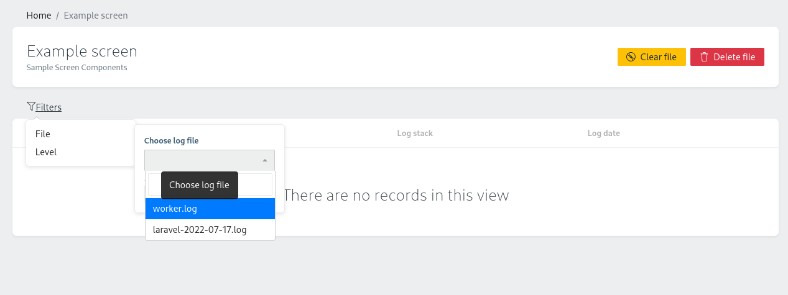
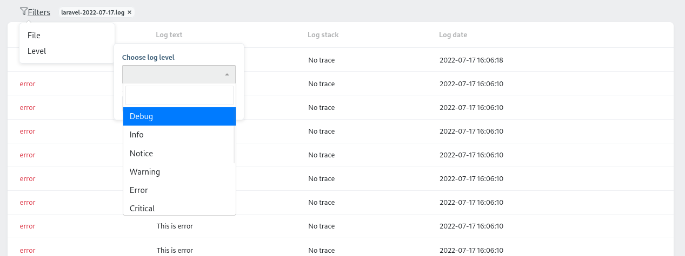
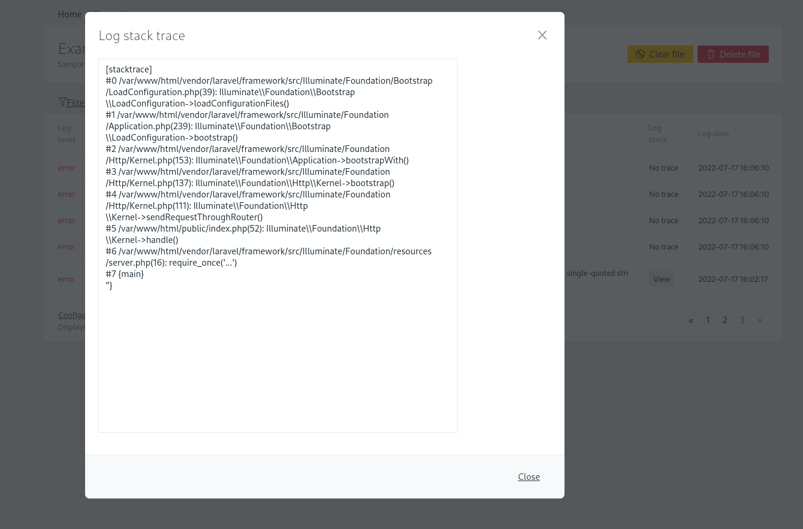

# Orchid Admin Panel Log Viewer

Based on [Laravel Log viewer](https://github.com/rap2hpoutre/laravel-log-viewer) and adapted for [Orchid](https://github.com/orchidsoftware/platform) admin panel

See every log entry within your admin panel, clear and delete files





> Requires at least PHP 8.0 and Laravel 9

## Installation

```bash
composer require czernika/orchid-log-viewer
```

## How to

1. Add `Czernika\OrchidLogViewer\Traits\HasLogViewerScreen` trait to your screen

```php
use Czernika\OrchidLogViewer\Traits\HasLogViewerScreen;
use Orchid\Screen\Screen;

class ExampleScreen extends Screen
{
    use HasLogViewerScreen;
```

2. Add command bar and layouts

```php
public function commandBar(): iterable
{
    return $this->logViewerCommandBar();
}

public function layout(): iterable
{
    return $this->logViewerLayout();
}
```

3. Add query parameters

```php
use Czernika\OrchidLogViewer\Contracts\LogServiceContract;

protected string $selected = 'laravel.log';

public function query(LogServiceContract $logService): iterable
{
    $this->selected = $logService->selected();

    return [
        'logs' => $logService->paginate(),
    ];
}
```

Returned key must be named `logs`. Selected property is selected file

4. Create log disk

```php
// filesystems.php
'disks' => [
    'log' => [
        'driver' => 'local',
        'root' => storage_path('logs'),
    ],
],
```

It should be named `log`. Otherwise publish config file

```bash
php artisan vendor:publish --tag=olv-config
```

and within `orchid-log.php` config file add disk name, where storage files located

That's it
